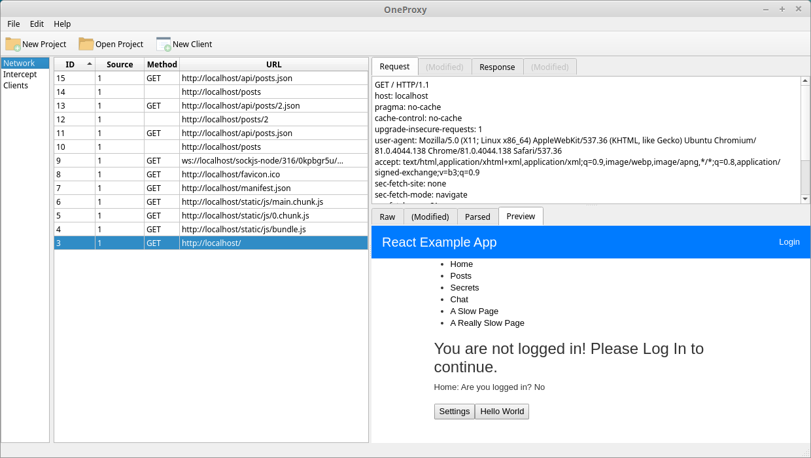

# OneProxy
[](https://app.circleci.com/pipelines/github/evanrolfe/oneproxy)

An HTTP (and websockets) proxy application for performing penetration tests against web applications, with advanced capabilities for handling single-page-applications.



## Key Features

- Detects which browsers you have installed and launches it pre-configured for OneProxy to intercept HTTPS requests
- Open multiple instances of the same browser in isolated-environments so you can keep multiple sessions active at the same time
- Uses the browser's API to grab the rendered HTML allowing you to view what you actually see in the browser
- Crawl SPAs (i.e. React sites) as well as traditional web applications
- Intercept and modify requests and responses

## Installation
Frontend requires Python v3.6.9 and Backend requires Node v12.17.0.

```
$ git clone git@github.com:evanrolfe/oneproxy-python.git
$ cd oneproxy-python
$ (cd src/backend; npm install)
$ scripts/compile_backend.sh
$ ./run.sh
```

## Contributing

**Frontend**

Changes to the .ui files in `src/frontend/ui` or asset files in `src/frontend/assets` need to be compiled to python files using these commands:
```
$ scripts/compile_frontend_ui.sh
$ scripts/compile_frontend_assets.sh
```

**Backend**

Compile the nodejs backend server to a single binary using this command:
```
$ scripts/compile_backend.sh
```

## Test

The integration tests require that you are running the mock server:
```bash
$ node src/backend/test/support/mock_server/index.js
```

## Notes

Icons come from:
https://icons8.com/icon/set/console/dusk
https://www.flaticon.com/search?word=terminal
